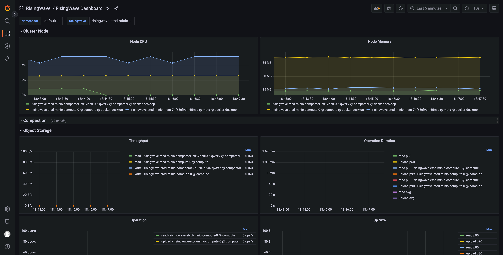
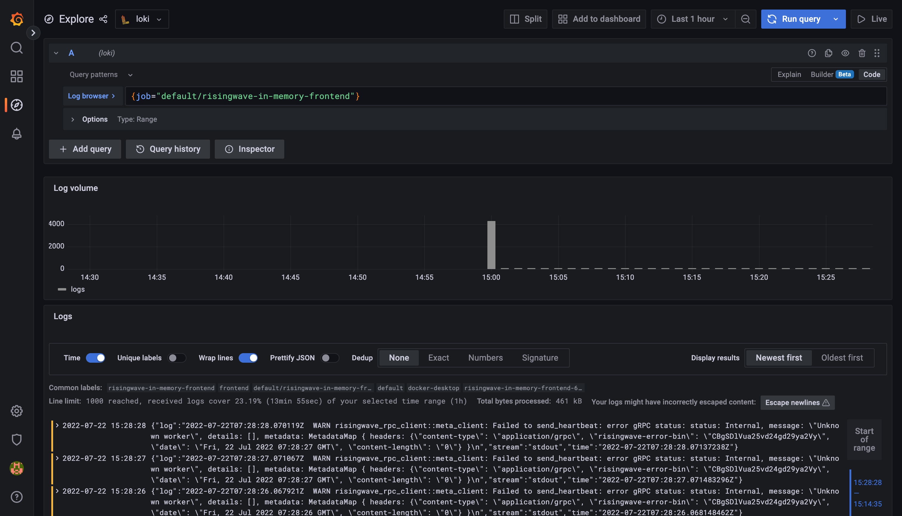

# RisingWave Operator

[](https://join.slack.com/t/risingwave-community/shared_invite/zt-120rft0mr-d8uGk3d~NZiZAQWPnElOfw)

[](https://codecov.io/gh/risingwavelabs/risingwave-operator)

## Introduction

The RisingWave operator is a deployment and management system of the [RisingWave streaming database](https://github.com/risingwavelabs/risingwave) that runs on top of Kubernetes. It provides functionalities like provisioning, upgrading, scaling and destroying the `RisingWave` instances inside the Kubernetes cluster. It models the deployment and management progress with the concepts provided in Kubernetes and organizes them in a way called [Operator Pattern](https://kubernetes.io/docs/concepts/extend-kubernetes/operator/). Thus we can just declare what kind of `RisingWave` instances we want and create them as objects in the Kubernetes. The RisingWave operator will always make sure that they are finally there.

The operator also contains several custom resources. Refer to the [API docs](./docs/general/api.md) for more details.

## Quick Start

### Installation

First, you need to install the `cert-manager` in the cluster before installing the `risingwave-operator`.

The default static configuration cert-manager can be installed as follows:

```shell
kubectl apply -f https://github.com/cert-manager/cert-manager/releases/download/v1.9.1/cert-manager.yaml
```

More information on this install cert-manager method [can be found here](https://cert-manager.io/docs/installation/#default-static-install).

Then, you can install the `risingwave-operator` with the following command:

```shell
kubectl apply -f https://github.com/risingwavelabs/risingwave-operator/releases/download/v0.2.0/risingwave-operator.yaml
```

To check if the installation is successful, you can run the following commands to check if the Pods are running.

```shell
kubectl -n cert-manager get pods
kubectl -n risingwave-operator-system get pods
```

### First RisingWave Instance

Now you can deploy a RisingWave instance with in-memory storage with the following command (be careful about the node arch):

```shell
# It runs on the Linux/amd64 platform. If you want to run on Linux/arm64, you need to run the command below.
kubectl apply -f https://raw.githubusercontent.com/risingwavelabs/risingwave-operator/main/examples/risingwave-in-memory.yaml

# Linux/arm64
curl https://raw.githubusercontent.com/risingwavelabs/risingwave-operator/main/examples/risingwave-in-memory.yaml | sed -e 's/ghcr.io\/risingwavelabs\/risingwave/public.ecr.aws\/x5u3w5h6\/risingwave-arm/g' | kubectl apply -f -
```

Check the running status of RisingWave with the following command:

```shell
kubectl get risingwave
```

The expected output is like this:

```plain
NAME                    RUNNING   STORAGE(META)   STORAGE(OBJECT)   AGE
risingwave-in-memory    True      Memory          Memory            30s
```

### Connect & Query

#### ClusterIP

By default, the operator will create a service for the frontend component, with the type of `ClusterIP` if not specified. It is not accessible from the outside. So we will create a standalone Pod of PostgreSQL inside the Kubernetes, which runs an infinite loop so that we can attach to it.

You can create one by following the commands below, or you can just do it yourself:

```shell
kubectl apply -f examples/psql/psql-console.yaml
```

And then you will find a Pod named `psql-console` running in the Kubernetes, and you can attach to it to execute commands inside the container with the following command:

```shell
kubectl exec -it psql-console bash
```

Finally, we can get access to the RisingWave with the `psql` command inside the Pod:

```shell
psql -h risingwave-in-memory-frontend -p 4567 -d dev -U root
```

#### NodePort

If you want to connect to the RisingWave from the nodes (e.g., EC2) in the Kubernetes, you can set the service type to `NodePort`, and run the following commands on the node:

```shell
export RISINGWAVE_NAME=risingwave-in-memory
export RISINGWAVE_NAMESPACE=default
export RISINGWAVE_HOST=`kubectl -n ${RISINGWAVE_NAMESPACE} get node -o jsonpath='{.items[0].status.addresses[?(@.type=="InternalIP")].address}'`
export RISINGWAVE_PORT=`kubectl -n ${RISINGWAVE_NAMESPACE} get svc -l risingwave/name=${RISINGWAVE_NAME},risingwave/component=frontend -o jsonpath='{.items[0].spec.ports[0].nodePort}'`

psql -h ${RISINGWAVE_HOST} -p ${RISINGWAVE_PORT} -d dev -U root
```

```yamlex
# ...
spec:
  global:
    serviceType: NodePort
# ...
```

#### LoadBalancer

For EKS/GCP and some other Kubernetes provided by cloud vendors, we can expose the Service to the public network with a load balancer on the cloud. We can simply achieve this by setting the service type to `LoadBalancer`, by setting the following field:

```yamlex
# ...
spec:
  global:
    serviceType: LoadBalancer
# ...
```

And then you can connect to the RisingWave with the following command:

```shell
export RISINGWAVE_NAME=risingwave-in-memory
export RISINGWAVE_NAMESPACE=default
export RISINGWAVE_HOST=`kubectl -n ${RISINGWAVE_NAMESPACE} get svc -l risingwave/name=${RISINGWAVE_NAME},risingwave/component=frontend -o jsonpath='{.items[0].status.loadBalancer.ingress[0].ip}'`
export RISINGWAVE_PORT=`kubectl -n ${RISINGWAVE_NAMESPACE} get svc -l risingwave/name=${RISINGWAVE_NAME},risingwave/component=frontend -o jsonpath='{.items[0].spec.ports[0].port}'`

psql -h ${RISINGWAVE_HOST} -p ${RISINGWAVE_PORT} -d dev -U root
```

## Storages

### Memory

Currently, memory storage is supported for test usage only. We highly discourage you use the memory storage for other purposes. For now, you can enable the memory metadata and object storage with the following configs:

```yamlex
#...
spec:
  storages:
    meta:
      memory: true
    object:
      memory: true
#...
```

### etcd (meta)

We recommend using the [etcd](https://etcd.io/) to store the metadata. You can specify the connection information of the `etcd` you'd like to use like the following:

```yamlex
#...
spec:
  storages:
    meta:
      etcd: 
        endpoint: risingwave-etcd:2388
        secret: etcd-credentials      # optional, empty means no authentication 
#...
```

Check the [examples/risingwave-etcd-minio.yaml](./examples/risingwave-etcd-minio.yaml) for how to provision a simple RisingWave with an `etcd` instance as the metadata storage.

### MinIO

We support using MinIO as the object storage. Check the [examples/risingwave-etcd-minio.yaml](./examples/risingwave-etcd-minio.yaml) for details. The YAML structure is like the following:

```yamlex
#...
spec:
  storages:
    object:
      minio:
        secret: minio-credentials
        endpoint: minio-endpoint:2388
        bucket: hummock001
#...
```

### S3

We support using AWS S3 as the object storage. Follow the steps below and check the [examples/risingwave-etcd-s3.yaml](./examples/risingwave-etcd-s3.yaml) for details:

First, you need to create a `Secret` with the name `s3-credentials`:

```shell
kubectl create secret generic s3-credentials --from-literal AccessKeyID=${ACCESS_KEY} --from-literal SecretAccessKey=${SECRET_ACCESS_KEY} --from-literal Region=${AWS_REGION}
```

Then, you need to create a `bucket` on the console, e.g., `hummock001`.

Finally, you can specify S3 as the object storage in YAML, like the following:

```yamlex
#...
spec:
  storages:
    object:
      s3:
        secret: s3-credentials
        bucket: hummock001
#...
```

## Monitoring

### Install the `kube-prometheus-stack`

Before getting started, you need to ensure that the [`helm`](https://helm.sh/) is installed. Please follow the instructions in the [Installing Helm](https://helm.sh/docs/intro/install/) chapter if you don't have one.

We encourage using the [`kube-prometheus-stack`](https://github.com/prometheus-community/helm-charts/tree/main/charts/kube-prometheus-stack), a helm chart maintained by the community, to install the `Prometheus operator` into the Kubernetes. Follow the instructions below to install:

- Add `prometheus-community` repo

```shell
helm repo add prometheus-community https://prometheus-community.github.io/helm-charts
helm repo update
```

- Install or upgrade chart

```shell
helm upgrade --install prometheus prometheus-community/kube-prometheus-stack \
  -f https://raw.githubusercontent.com/risingwavelabs/risingwave-operator/main/monitoring/kube-prometheus-stack/kube-prometheus-stack.yaml
```

To check the running status, check the Pods with the following command:

```shell
kubectl get pods -l release=prometheus
```

The expected output is like this:

<!-- spellchecker: disable -->
```plain
NAME                                                   READY   STATUS    RESTARTS   AGE
prometheus-kube-prometheus-operator-5f6c8948fb-llvzm   1/1     Running   0          173m
prometheus-kube-state-metrics-59dd9ffd47-z4777         1/1     Running   0          173m
prometheus-prometheus-node-exporter-llgp9              1/1     Running   0          169m
```

#### Prometheus RemoteWrite (AWS)

Prometheus has provided a functionality called [`remote-write`](https://prometheus.io/docs/prometheus/latest/configuration/configuration/#remote_write), and AWS provides a [managed Prometheus service](https://aws.amazon.com/prometheus/), so we can write the local metrics to the Prometheus on the cloud.

Before getting started, you need to ensure that you have an account which has the permission to write the managed Prometheus, i.e., with the `AmazonPrometheusRemoteWriteAccess` permission.

Follow the instructions below to set up the remote write:

1. Create a Secret to store the AWS credentials.

```shell 
kubectl create secret generic aws-prometheus-credentials --from-literal AccessKey=${ACCESS_KEY} --from-literal SecretAccessKey=${SECRET_ACCESS_KEY}
```

2. Copy the [prometheus-remote-write-aws.yaml](./monitoring/kube-prometheus-stack/prometheus-remote-write-aws.yaml) file and replace the values of the these variables:
  - `${KUBERNETES_NAME}`: the name of the Kubernetes, e.g., `local-dev`. You can also add `externalLabels` yourself.
  - `${AWS_REGION}`: the region of the AWS Prometheus service, e.g., `ap-southeast-1`
  - `${WORKSPACE_ID}`: the workspace ID, e.g., `ws-12345678-abcd-1234-abcd-123456789012`

3. Install or upgrade the `kube-prometheus-stack`.

```shell
helm upgrade --install prometheus prometheus-community/kube-prometheus-stack \
  -f https://raw.githubusercontent.com/risingwavelabs/risingwave-operator/main/monitoring/kube-prometheus-stack/kube-prometheus-stack.yaml \
  -f prometheus-remote-write-aws.yaml
```

Now, you can check the Prometheus logs to see if the remote write works, with the following commands:

```shell
kubectl logs prometheus-prometheus-kube-prometheus-prometheus-0
```

The expected output is like this:

```plain
ts=2022-07-20T09:46:38.437Z caller=dedupe.go:112 component=remote level=info remote_name=edcf97 url=https://aps-workspaces.ap-southeast-1.amazonaws.com/workspaces/ws-12345678-abcd-1234-abcd-123456789012/api/v1/remote_write msg="Remote storage resharding" from=2 to=1
```

### Start monitoring

The RisingWave operator has integrated with the [Prometheus Operator](https://github.com/prometheus-operator/prometheus-operator). If you have installed the Prometheus Operator in the Kubernetes, it will create a `ServiceMonitor` for the `RisingWave` object and keep it synced automatically. You can check the `ServiceMonitor` with the following command:

```shell
kubectl get servicemonitors -l risingwave/name
```

The expected output is like this:

```plain
NAME                              AGE
risingwave-risingwave-etcd-minio   119m
```

Let's try to forward the web port of Grafana to localhost, with the following command:

```shell
kubectl port-forward svc/prometheus-grafana 3000:http-web
```

Now we can access the Grafana inside the Kubernetes via [http://localhost:3000](http://localhost:3000). By default, the username is `admin` and the password is `prom-operator`.
Let's open the `RisingWave/RisingWave Dashboard` and select the instance you'd like to observe, and here are the panels.



### Logging

In addition to the metrics collection and monitoring, we can also integrate the logging stack into the Kubernetes. One of the famous
open source logging stacks is the [Grafana loki](https://grafana.com/docs/loki/latest/). Follow the instructions below to install them in the Kubernetes:

NOTE: this tutorial requires that you have the `helm` and the `kube-prometheus-stack` installed. You can follow the tutorials above to install them.

1. Add the `grafana` repo and update

```shell
helm repo add grafana https://grafana.github.io/helm-charts
helm repo update
```

2. Install the `loki-distributed` chart, including the components of loki

```shell
helm upgrade --install loki grafana/loki-distributed
```

3. Install the `promtail` chart, which is an agent that collects the logs and pushes them into the loki

```shell
helm upgrade --install promtail grafana/promtail \
  -f https://raw.githubusercontent.com/risingwavelabs/risingwave-operator/main/monitoring/promtail/loki-promtail-clients.yaml
```

4. Upgrade or install the `kube-prometheus-stack` chart

```shell
helm upgrade --install prometheus prometheus-community/kube-prometheus-stack \
  -f https://raw.githubusercontent.com/risingwavelabs/risingwave-operator/main/monitoring/kube-prometheus-stack/kube-prometheus-stack.yaml \
  -f https://raw.githubusercontent.com/risingwavelabs/risingwave-operator/main/monitoring/kube-prometheus-stack/grafana-loki-data-source.yaml
```

Now, we are ready to view the logs in Grafana. Just forward the traffics to the localhost, and open the [http://localhost:3000](http://localhost:3000) like mentioned in the 
chapter above. Navigate to the `Explore` panel on the left side, and select the loki as data source. Here's an example:



## License

The RisingWave operator is developed under the Apache License 2.0. Please refer to [LICENSE](LICENSE) for more information.

## Contributing

Thanks for your interest in contributing to the project! Please refer to the [Contribution and Development Guidelines](CONTRIBUTING.md) for more information.
