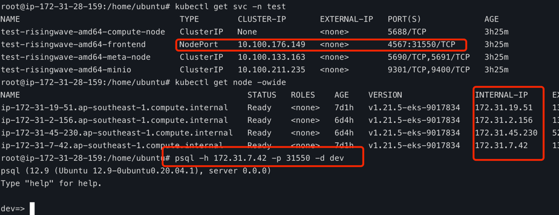

## Introduction

The RisingWave Kubernetes Operator is a RisingWave deployment management tool based on kubernetes. The risingwave-operator currently supports the following custom resources:
- risingwave.singularity-data.com
- risingwave-monitor.singularity-data.com(not implement)

## Quick Start

#### Install cert-manager
We need install `cert-manager` in cluster before install risingwave-operator.

The default static configuration cert-manager can be installed as follows:

``
kubectl apply -f https://github.com/cert-manager/cert-manager/releases/download/v1.8.0/cert-manager.yaml
``

More information on this install cert-manger method [can be found here](https://cert-manager.io/docs/installation/#default-static-install).

#### Install risingwave-operator

Install risingwave-operator can be installed as follows:

``
kubectl apply -f https://raw.githubusercontent.com/singularity-data/risingwave-operator/main/config/risingwave-operator.yaml
``

## Examples
You can deploy RisingWave which use MinIO on Linux/amd64 arch nodes as follows:

``
kubectl apply -f https://raw.githubusercontent.com/singularity-data/risingwave-operator/main/examples/minio-risingwave-amd.yaml
``

## First Query

#### Install psql
To connect to the RisingWave server, you will need to install `psql` in advance.

[How to install psql](https://www.timescale.com/blog/how-to-install-psql-on-mac-ubuntu-debian-windows/)

#### Query
We use kubernetes `NodePort` service for frontend.   

Please get the nodePort of the frontend service as `psql port` and get the `INTERNAL-IP` address of any node as follows:

``
PHOST=`kubectl get node -o=jsonpath='{.items[0].status.addresses[?(@.type=="InternalIP")].address}'`
``

``
PPORT=`kubectl get service -n test test-risingwave-amd64-frontend -o=jsonpath='{.spec.ports[0].nodePort}'`
``

Connect to the frontend by `psql` as follows:

`psql -h $PHOST -p $PPORT -d dev`

## Configuration
You can get risingwave-operator configuration as follows:

``
kubectl get cm risingwave-operator-controller-manager-config -n risingwave-operator-system -oyaml
``

If you edit the configmap, please kill the risingwave-operator pods and configuration file will be load.

## License

The risingwave-operator is under the Apache License 2.0. Please refer to [LICENSE](LICENSE) for more information.
