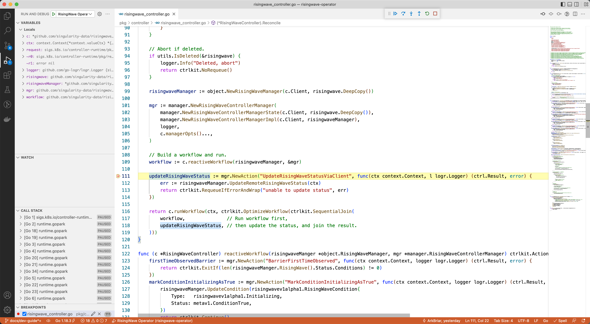

# Development Guide

This document is a guide to start developing the RisingWave operator.

Please submit an [issue](https://github.com/risingwavelabs/risingwave-operator/issues) on Github if you

* Notice a requirement that this doc does not capture
* Find a different doc that specifies requirements (the doc should instead link here)

## Set up the development environment

There are no restrictions in choosing the platform for development. However, we recommend you use a Linux/macOS since they have been verified.

### Hardware Requirements

We recommend the following for any physical or virtual machine being used for developing the RisingWave operator.

* 8GB of RAM
* 40GB of free disk space

The hardware resources are mainly used for the Docker and Kubernetes.

### Installing Required Software

#### Go

If you don't have a Go development environment, please follow the instructions in the [Go Download and Install](https://go.dev/doc/install).

Confirm that your `GOPATH` and `GOBIN` environment variables are correctly set as detailed in [How to Write Go Code](https://go.dev/doc/code) before proceeding.

Currently, building the RisingWave operator requires Go 1.18 or later.

#### Docker

Debugging the RisingWave operator locally requires a Docker environment. To install Docker in your development environment, [follow the instructions from the Docker website](https://docs.docker.com/get-docker/).

#### kubectl

You need to install the `kubectl` command-line tool to run commands against Kubernetes clusters. To install it, please follow the instructions in the [Install Tools](https://kubernetes.io/docs/tasks/tools/).

The RisingWave operator now requires a 1.16+ Kubernetes cluster, which means you should also keep the requirements valid for `kubectl`.

#### CSpell

We use `CSpell` now to check the spelling of our project. Please follow the instructions in the [Welcome to CSpell](https://cspell.org/).

#### pre-commit

We recommend using the [pre-commit](https://pre-commit.com/) to identify simple issues before submission to code review. We've already written [a pre-defined config](https://github.com/risingwavelabs/risingwave-operator/blob/main/.pre-commit-config.yaml). Please follow the instructions detailed in the [pre-commit website](https://pre-commit.com/) to install the tool and pre-commit hooks.

#### psql

RisingWave provides the PostgreSQL protocol wire compatibility. You can connect the RisingWave with `psql` CLI tool. Please follow the instructions described in the [PostgreSQL Downloads](https://www.postgresql.org/download/) to install. Here're some convenient commands to use if you have the same platform and software management tool.

For macOS, homebrew:

```bash
brew install postgresql
```

For Debian family (Ubuntu/Debian) Linux distributions:

```bash
sudo apt install postgresql-client
```

For Red Hat family (Red Hat Enterprise/Rocky/CentOS/Fedora) and SUSE family (SUSE Enterprise/openSUSE) Linux distributions:

```bash
sudo yum install postgresql
```

or

```bash
sudo dnf install postgresql
```

#### Other tools

We have several tools aside from those mentioned above, they would be automatically downloaded by the makefile target. You can also install them manually.

* [controller-gen](https://github.com/kubernetes-sigs/controller-tools), >= 0.9
* [goimports-reviser](https://github.com/incu6us/goimports-reviser), >= 2.5
* [golangci-lint](https://github.com/golangci/golangci-lint), >= 1.45
* [kustomize](https://github.com/kubernetes-sigs/kustomize), >= v0.13
* [setup-envtest](https://github.com/kubernetes-sigs/controller-runtime/tree/master/tools/setup-envtest), latest
* [ctrlkit-gen](https://github.com/arkbriar/ctrlkit/ctrlkit/cmd/ctrlkit-gen), latest

## Building the RisingWave operator

To build a binary of the RisingWave operator, run the following command:

```bash
make build
```

The binary would be generated in the `bin` directory.

To build a Docker/OCI-compatible image of the RisingWave operator, run the following command:

```bash
# Build a image and tag with "ghcr.io/risingwavelabs/risingwave-operator:latest"
make docker-build

# Build a image and tag with "risingwave/risingwave-operator:latest"
REGISTRY=risingwave make docker-build

# Build a image and tag with "risingwave/risingwave-operator:nightly"
TAG=nightly make docker-build
```

To build cross-platform (linux/amd64,linux/arm64) images , run the following command:

```bash
make docker-cross-build
```

## Debugging the RisingWave operator

The RisingWave operator consists of two main components

* a webhook server serving the mutating and validation webhooks
* a set of controllers control the operation of CRs (RisingWave)

### Provisioning a local Kubernetes cluster

There're many kinds of local Kubernetes, please follow the instructions they provided to provision the Kubernetes locally:

* [Kubernetes in Docker Desktop](https://docs.docker.com/desktop/kubernetes/)
* [minikube](https://minikube.sigs.k8s.io/docs/start/) using Docker as its driver
* [kind](https://kind.sigs.k8s.io/docs/user/quick-start/#installation) using Docker as its driver
* Other kinds of Kubernetes clusters running inside the Docker VM...

We recommend using the Kubernetes embed or the minikube to provision your local Kubernetes cluster.

### Setting up the Webhook

If you use the Docker desktop to run the Kubernetes cluster (those mentioned above), there's a pre-defined manifest and pre-generated certificate. You can simply install the certificates by running the following command:

```bash
make copy-local-certs
```

and now you are ready to start a local operator and debug it.

However, if you use other Kubernetes deployments, e.g., minikube in a VM, you have to prepare the certificates and manifests manually.

**The following content is a little bit advanced. You have to know more details about the webhooks. Read the introduction about the [Dynamic Admission Control](https://kubernetes.io/docs/reference/access-authn-authz/extensible-admission-controllers/) before you get started.**

To debug locally, one thing you have to ensure is that the `api-server` of the Kubernetes cluster must have access to your host environment, specifically the webhook server (HTTP server).

#### Generate the certificates

Find the IP or hostname of your host that the `api-server` has access to, say that is:

* IP: 192.18.0.1
* or Hostname: host.minikube.local

Run the following commands to generate a certificate for an IP:

```bash
mkdir -p ${TMPDIR}/k8s-webhook-server/serving-certs
export IP=192.18.0.1
openssl req -x509 -newkey rsa:4096 -sha256 -days 3650 -nodes \
    -keyout ${TMPDIR}/k8s-webhook-server/serving-certs/tls.key \
    -out ${TMPDIR}/k8s-webhook-server/serving-certs/tls.crt -subj "/CN=localhost" \
    -extensions san -config <(echo '[req]'; echo 'distinguished_name=req'; echo '[san]'; echo "subjectAltName=IP:${IP}")
```

Run the following commands to generate a certificate for a hostname:

```bash
mkdir -p ${TMPDIR}/k8s-webhook-server/serving-certs
export HOST=host.minikube.local
openssl req -x509 -newkey rsa:4096 -sha256 -days 3650 -nodes \
    -keyout ${TMPDIR}/k8s-webhook-server/serving-certs/tls.key \
    -out ${TMPDIR}/k8s-webhook-server/serving-certs/tls.crt -subj "/CN=localhost" \
    -extensions san -config <(echo '[req]'; echo 'distinguished_name=req'; echo '[san]'; echo "subjectAltName=DNS:${HOST}")
```

#### Install the webhook configurations

Modify the [config/local/webhook.yaml](/config/local/webhook.yaml) to match your IP/hostname and certificates:

1. Replace the `webhooks.*.clientConfig.caBundle` with the base64 encoded CA certs, which can be obtained by running the following command:

```bash
base64 ${TMPDIR}/k8s-webhook-server/serving-certs/tls.crt
```

2. Replace the `host.docker.internal` in `webhooks.*.clientConfig.url` with your host IP or hostname used above, like this:

```yaml
webhooks:
- clientConfig:
    url: "https://192.168.0.1:9443/validate-risingwave-risingwavelabs-com-v1alpha1-risingwave"
```

Now you're all set! Let's start debugging the RisingWave operator!

### Start debugging

Before getting started, please run the following commands to perform some checks and try running the operator locally:

#### Check the Kubernetes cluster

```bash
kubectl version --short
```

Expect output:

```bash
Client Version: v1.24.2
Kustomize Version: v4.5.4
Server Version: v1.24.0
```

#### Install the local manifests

The local manifests contain the CRD and the webhook configurations, run the following command to install them:

```bash
make install-local
```

Check the CRDs and webhook configurations with the following commands:

```bash
kubectl get crd
```

Expected output:

```bash
NAME                                          CREATED AT
risingwaves.risingwave.risingwavelabs.com   2022-06-21T06:17:20Z
```

```bash
kubectl get mutatingwebhookconfiguration,validatingwebhookconfiguration
```

Expected output:

```bash
NAME                                                                                                           WEBHOOKS   AGE
mutatingwebhookconfiguration.admissionregistration.k8s.io/risingwave-operator-mutating-webhook-configuration   1          19h

NAME                                                                                                               WEBHOOKS   AGE
validatingwebhookconfiguration.admissionregistration.k8s.io/risingwave-operator-validating-webhook-configuration   1          19h
```

#### Run the operator locally

You can find an example of the expected output in this [PR](https://github.com/risingwavelabs/risingwave-operator/pull/87).

```bash
make run-local
```

Now stop the process and we're ready for debugging.

#### Start debugging in VSCode

Debugging in VSCode requires a launch configuration, you can use the following configuration:

```jsonc launch.json
{
    // Use IntelliSense to learn about possible attributes.
    // Hover to view descriptions of existing attributes.
    // For more information, visit: https://go.microsoft.com/fwlink/?linkid=830387
    "version": "0.2.0",
    "configurations": [
        {
            "name": "RisingWave Operator",
            "type": "go",
            "request": "launch",
            "mode": "auto",
            "program": "${workspaceFolder}/cmd/manager/manager.go",
            "args": [
                "-zap-time-encoding", "rfc3339",
                "-config-file"
            ],
            "env": {
                "NO_PROXY": "kubernetes.docker.internal,127.0.0.1,localhost"
            },
        }
    ]
}
```

Now start debugging by clicking the menu **[Run > Start Debugging]** or pressing **F5**. The following is a list of significant functions/methods/files that might be useful as breakpoints:

* `main() cmd/manager/manager.go`, the entry point of the RisingWave operator
* `RisingWaveController.Reconcile() pkg/controller/risingwave_controller.go`, the core function of the RisingWave operator
* `pkg/webhook/risingwave_mutating_webhook.go`, the entry point of the mutating admission webhook for RisingWave
* `pkg/webhook/risingwave_validating_webhook.go`, the callbacks of the validating admission webhook for RisingWave



#### Start debugging in other IDEs

Follow the instructions of [GoLand Debugging](https://www.jetbrains.com/help/go/debugging-code.html) to launch a debugging process like in VSCode.
