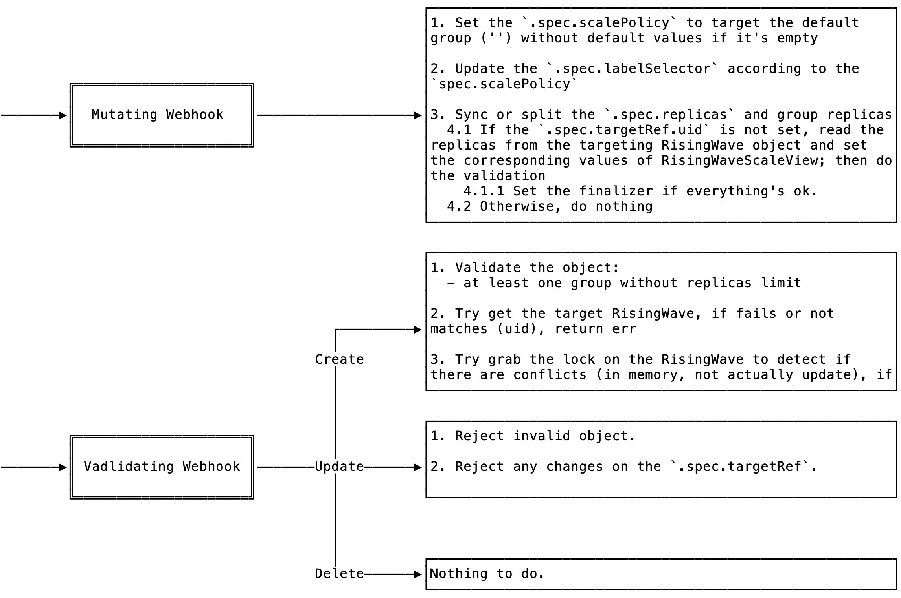

|                    |                                                         |
| -------            |---------------------------------------------------------|
| Feature            | Expose the scale subresource with `RisingWaveScaleView` |
| Status             | In-progress                                             |
| Date               | 2022-09-05                                              |
| Authors            | arkbriar                                                |
| RFC PR #           | #204                                                    |
| Implementation PR #|                                                         |
|                    |                                                         |

# **Summary**

The RFC aims to provide a new CR to support the [scale subresource](https://kubernetes.io/docs/tasks/extend-kubernetes/custom-resources/custom-resource-definitions/#scale-subresource) over groups of some user-specified component of
the RisingWave resource. With that, the users can benefit from the scale subresource and apply any tools that have such
requirement. For example, the horizontal auto-scaling service (HPA/[KEDA](https://github.com/kedacore/keda)) will work
after this is implemented.

# **Motivation**

> Why are we doing this?

The [scale subresource](https://kubernetes.io/docs/tasks/extend-kubernetes/custom-resources/custom-resource-definitions/#scale-subresource)
is
a subresource like the status but exposes three fixed fields:

- `.spec.replicas` which refers to the desired replicas
- `.status.replicas` which refers to the current replicas
- `.status.selector` which refers to the Pod selector (but in a serialized manner)

However, the current design of the `RisingWave` resource can not provide such a subresource because it is consisted of
four independent components, and each of the component can have one or more groups. Therefore, the `kubectl scale` can
not work directly on the `RisingWave` resource and so do other tools depend on that. And it is the main reason for
proposing this new CR. I named it 'RisingWaveScaleView'.

> What use cases does it support?

With the `RisingWaveScaleView`, the users can set up a view (similar to the view in databases) of some groups
of one RisingWave component, in a `RisingWave` object, to expose the scale subresource. Then the magic happens and
everything that depends on the scale subresource shall work.

Take the auto-scaler as an example, we can set up the HPA or KEDA for frontend Pods with
a `RisingWaveScaleView` that targets the frontend groups.

> What is the expected outcome?

1. A CR `RisingWaveScaleView` and its controller, with the following features:
    - Users can target any of the four components in it, but aren't able to change it after.
    - Users can target one or more valid groups in it, but aren't able to change it after.
    - Users can set the priorities of groups for scaling out and in separately.
    - It reflects all the fields required by the scale subresource described above and keeps them synced with the
      RisingWave's.
    - It locks the target RisingWave object on the specified groups and prevents the direct modifications (either update
      or delete) on the related fields.
        - It acquires the lock at the creation and removes it before deletion.

2. An improvement on `RisingWave` resource and validating webhook to support lock of groups:
    - Lock fields in the status, which is structured and easy to lookup.
    - Enhanced validating webhook to reject any changes from besides the controller of `RisingWaveScaleView`.

# **Explanation**

> This is the technical portion of the RFC. Explain the design in sufficient detail.

## `RisingWaveScaleView` CRD

```yaml
apiVersion: risingwave.risingwavelabs.com/v1alpha1
kind: RisingWaveScaleView
metadata:
  name: hello-frontend-scale-view
spec:
  targetRef:
    name: hello             # Name of the RisingWave object, in the same namespace.
    component: frontend     # One of meta, frontend, compute, and compactor.
  replicas: 10              # Target replicas. It will be synced from the RisingWave object when the controller grabs the lock.
  # Strict verification mode on replicas:
  #   1. If enabled, the validating webhook will reject any invalid changes on .spec.replicas (e.g., exceeding the min/max range)
  #   2. If disabled, the mutating webhook will adjust the .spec.replicas to be enclosed by the range.
  # Serialized label selector. Would be set by the webhook.
  strict: false
  labelSelector: "risingwave/name=hello,risingwave/component=frontend,risingwave/group in (enduring,spot)"
  scalePolicy: # An array of groups and the policies for scale, 
  # optional and empty means the default group with the default policy.
  # The order here indicates the priorities.

  - group: 'enduring'       # Target group name
    # 0-10, optional. The groups will be sorted by the priority and the current replicas. 
    # The higher it is, the more replicas of the target group will be considered kept, i.e. scale out first, scale in last.
    priority: 1
    replicas: 2             # Controlled field, maintained by the mutating webhook. Current desired replicas.
    constraints:
      min: 1              # >= 0, optional, default is 0
      max: 2              # >= minimum, optional, default is 1000 (indicates infinite because 1000 Pods are many enough to be considered as infinite).
  - group: 'spot'
    priority: 0
    replicas: 3
status:
  targetRef: # It has value only if the scale view has grabbed the lock on the target object.
    uid:                    # UID of the target object.           
  replicas: 10             # Current replicas of target groups. Maintained by the controller.
```

### Priority and Replica Constraints

When updating the scale subresource, it's updating the `.spec.replicas` field above. The mutating webhook will then work
to distribute the replicas of `.spec.replicas` to the replicas under the `scalePolicy`, following the rules below:

- The replicas in each group must be confined within the constraints.
- The groups with higher priorities always consume replicas first until it reaches the max boundary. E.g.,
  when `.spec.replicas` is 4, the 'enduring' group (with priority 1, larger than the 'spot' group's) will have 2 (which
  is the max) replicas, and then the left is assigned to the 'spot' group.
- The groups with the same priorities tend to have similar replicas, within the constraints. Which is to say, the target
  is to minimize the variance.

## `RisingWave` CRD and Webhooks

```yaml
apiVersion: risingwave.risingwavelabs.com/v1alpha1
kind: RisingWave
metadata:
  name: hello
# ....
status:
  scaleViews: # An array of scale view summaries. Maintained by the RisingWaveScaleView controller.
  - name: hello-frontend-scale-view # Name of the RisingWaveScaleView object.
    uid:                            # UID of the object.
    component: frontend             # Component.
    generation: 10                  # Generation of the RisingWaveScaleView object. It indicates the locked version.
    groupReplicas: # Group and their desired replicas. Once a group is owned by some scale view, then another scale view
    # would not be able to grab the lock again. It's achieved with the atomic update.
    # If a group and its desired replicas is listed below, then any changes to the target group's replicas will be rejected
    # unless it equals to the replicas here (hence locks that group). This should be guaranteed by the webhook. 
    - name: 'enduring'
      replicas: 1
    - name: 'spot'
      replicas: 3
```

Validating webhook:

- If the webhook observes scaleViews field, it must check the replicas field of each target groups and reject any change
  not matches.

This is a compatible change and should not affect the RisingWave's workflow.

## `RisingWaveScaleView` Webhooks



## `RisingWaveScaleView` Controller


## Use Cases

Case 1. Multi-AZ frontend and balanced scale

```yaml
apiVersion: risingwave.singularity-data.com/v1alpha1
kind: RisingWave
metadata:
  name: multi-az
spec:
  components:
    frontend:
      groups:
      - name: az-1
        replicas: 1
      - name: az-2
        replicas: 1
  # ....
---
apiVersion: risingwave.risingwavelabs.com/v1alpha1
kind: RisingWaveScaleView
metadata:
  name: multi-az-frontend-sv
spec:
  targetRef:
    name: multi-az
    component: frontend
  scalePolicy:
  - group: az-1
  - group: az-2
```

When scaling with the `multi-az-frontend-sv`, the replicas of group `az-1` and `az-2` will increase/decrease
alternately.

```shell
# Results in 2 replicas in az-1 and 2 replicas in az-2
kubectl scale --replicas=4 risingwavescaleview/multi-az-frontend-sv
```

Case 2. Compactor auto scales onto spot instances

```yaml
apiVersion: risingwave.risingwavelabs.com/v1alpha1
kind: RisingWavePodTemplate
metadata:
  name: spot-toleration
template:
  metadata:
    labels:
      risingwave/spot: "1"
  spec:
    containers: [ ]
    tolerations:
    - key: spot
      operator: Exists
      effect: NoSchedule
---
apiVersion: risingwave.singularity-data.com/v1alpha1
kind: RisingWave
metadata:
  name: spot-c
spec:
  components:
    compactor:
      groups:
      - name: normal
        replicas: 1
      - name: spot
        replicas: 0
        podTemplate: spot-toleration
  # ....
---
apiVersion: risingwave.risingwavelabs.com/v1alpha1
kind: RisingWaveScaleView
metadata:
  name: spot-c-compactor-sv
spec:
  targetRef:
    name: spot-c
    component: compactor
  scalePolicy:
  - group: normal
    priority: 1
    constraints:
      max: 2
  - group: spot
```

```shell
# Results in 1 replicas in normal and 0 replicas in spot
kubectl scale --replicas=1 risingwavescaleview/spot-c-compactor-sv

# Results in 2 replicas in normal and 0 replicas in spot
kubectl scale --replicas=2 risingwavescaleview/spot-c-compactor-sv

# Results in 2 replicas in normal and 2 replicas in spot
kubectl scale --replicas=4 risingwavescaleview/spot-c-compactor-sv
```

# **Drawbacks**

> Why should we not do this?

It locks part of `RisingWave` object to prevent from accidental updates but without explicit notices. The users or
programs are not able to know if they can update it or not before the actual update happens.

# **Rationale and Alternatives**

> Why is this design the best in the space of possible designs?

I guess it's first design to maintain a scale view of multi-component resources. However, there are some considerations.

Q1: Why making the `scaleViews` in status subresource of RisingWave?

To ensure the end users can not touch these maintained fields accidentally.

Q2: How can we ensure the consistency between spec and status subresource? They are intended to be updated individually.

Whether separating the status subresource or not doesn't affect the optimistic concurrency policy used to resolve
conflicts when updating. In one word, the update on metadata and spec and on status share the same lock. We can assume
that either update is an atomic update on the whole object. So the webhook always observes a consistent object.

Q3: Why is there a lock on the RisingWave? What's the purpose?

It is meant to disable the two-way synchronization between the `RisingWaveScaleView` and `RisingWave` objects.
Considering that we don't have such lock mechanism, the end users can update the replicas on `RisingWave` while the
replicas of that group is monitored by the `RisingWaveScaleView`. Then there will be two ways of sync:

- `RisingWaveScaleView` -> `RisingWave`
- `RisingWave` -> `RisingWaveScaleView`

Currently, I have no idea how to tell which way we should choose to sync. Even though we have figured out how, the
result will be rather confusing when there are two simultaneous updating. Therefore, using a lock on field to let the
users know where to update it is more reasonable.

> What other designs have been considered and what is the rationale for not choosing them?

None.

> What is the impact of not doing this?

We are not able to leverage the existing auto-scaling services.

# **Unresolved questions**

# **Future Possibilities**
