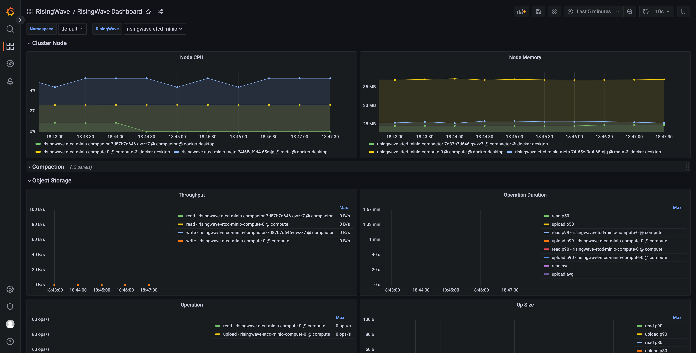

# Monitoring Guidance

## Install the `kube-prometheus-stack`

You can install the monitoring stack manually or via the install script.

```shell
./monitoring/install.sh
```

It will create the `monitoring` namespace and deploy everything inside it.

## Start monitoring

The RisingWave operator has integrated with the [Prometheus Operator](https://github.com/prometheus-operator/prometheus-operator). If you have installed the Prometheus Operator in the Kubernetes, it will create a `ServiceMonitor` for the `RisingWave` object and keep it synced automatically. You can check the `ServiceMonitor` with the following command:

```shell
kubectl get servicemonitors -A -l risingwave/name
```

The expected output is like this:

```plain
NAMESPACE    NAME                         AGE
monitoring   risingwave-service-monitor   119m
```

Let's try to forward the web port of Grafana to localhost, with the following command:

```shell
kubectl port-forward -n monitoring svc/prometheus-grafana 3000:http-web
```

Now we can access the Grafana inside the Kubernetes via [http://localhost:3000](http://localhost:3000). By default, the username is `admin` and the password is `prom-operator`.
Let's open the `RisingWave/RisingWave Dashboard` and select the instance you'd like to observe, and here are the panels.

The command above allows access from the local machine only.
If we want to let Grafana accept requests from external hosts, e.g. another machine:
```shell
kubectl port-forward -n monitoring svc/prometheus-grafana 3000:http-web --address 0.0.0.0
```


