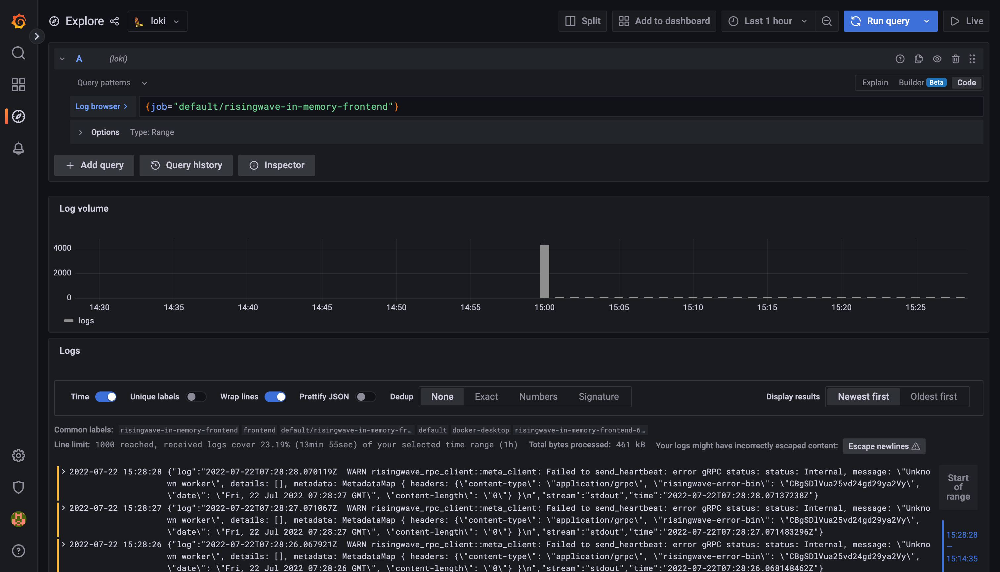

# Monitoring Guidance

## Install the `kube-prometheus-stack`

You can install the monitoring stack manually or via the install script.

```shell
./monitoring/install.sh
```

It will create the `monitoring` namespace and deploy everything inside it.

## Start monitoring

The RisingWave operator has integrated with the [Prometheus Operator](https://github.com/prometheus-operator/prometheus-operator). If you have installed the Prometheus Operator in the Kubernetes, it will create a `ServiceMonitor` for the `RisingWave` object and keep it synced automatically. You can check the `ServiceMonitor` with the following command:

```shell
kubectl get servicemonitors -l risingwave/name
```

The expected output is like this:

```plain
NAME                              AGE
risingwave-risingwave-etcd-minio   119m
```

Let's try to forward the web port of Grafana to localhost, with the following command:

```shell
kubectl port-forward -n monitoring svc/prometheus-grafana 3000:http-web
```

Now we can access the Grafana inside the Kubernetes via [http://localhost:3000](http://localhost:3000). By default, the username is `admin` and the password is `prom-operator`.
Let's open the `RisingWave/RisingWave Dashboard` and select the instance you'd like to observe, and here are the panels.


## Logging

In addition to the metrics collection and monitoring, we can also integrate the logging stack into the Kubernetes. One of the famous
open source logging stacks is the [Grafana loki](https://grafana.com/docs/loki/latest/). Follow the instructions below to install them in the Kubernetes:

NOTE: this tutorial requires that you have the `helm` and the `kube-prometheus-stack` installed. You can follow the tutorials above to install them.

1. Add the `grafana` repo and update

```shell
helm repo add grafana https://grafana.github.io/helm-charts
helm repo update
```

2. Install the `loki-distributed` chart, including the components of loki

```shell
helm --namespace monitoring --create-namespace upgrade --install loki grafana/loki-distributed
```

3. Install the `promtail` chart, which is an agent that collects the logs and pushes them into the loki

```shell
helm --namespace monitoring --create-namespace upgrade --install promtail grafana/promtail \
  -f https://raw.githubusercontent.com/risingwavelabs/risingwave-operator/main/monitoring/promtail/loki-promtail-clients.yaml
```

4. Upgrade or install the `kube-prometheus-stack` chart

```shell
helm --namespace monitoring --create-namespace upgrade --install prometheus prometheus-community/kube-prometheus-stack \
  -f https://raw.githubusercontent.com/risingwavelabs/risingwave-operator/main/monitoring/kube-prometheus-stack/kube-prometheus-stack.yaml \
  -f https://raw.githubusercontent.com/risingwavelabs/risingwave-operator/main/monitoring/kube-prometheus-stack/grafana-loki-data-source.yaml
```

Now, we are ready to view the logs in Grafana. Just forward the traffics to the localhost, and open the [http://localhost:3000](http://localhost:3000) like mentioned in the
chapter above. Navigate to the `Explore` panel on the left side, and select the loki as data source. Here's an example:

